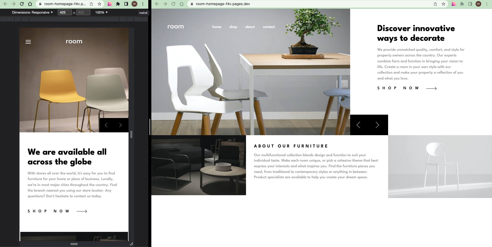

# Frontend Mentor - Room homepage solution

This is a solution to the [Room homepage challenge on Frontend Mentor](https://www.frontendmentor.io/challenges/room-homepage-BtdBY_ENq).

## Table of contents

- [Overview](#overview)
  - [The challenge](#the-challenge)
  - [Screenshot](#screenshot)
  - [Links](#links)
- [My process](#my-process)
  - [Built with](#built-with)
  - [What I learned](#what-i-learned)
  - [Continued development](#continued-development)
- [Author](#author)
- [Acknowledgments](#acknowledgments)

## Overview

### The challenge

Users should be able to:

- View the optimal layout for the site depending on their device's screen size
- See hover states for all interactive elements on the page
- Navigate the slider using either their mouse/trackpad or keyboard

### Screenshot

### Links

- Solution: [frontendmentor.io](https://www.frontendmentor.io/solutions/room-homepage-YCAUsEVO1r)

- Live Site: [cloudflare](https://room-homepage-f4v.pages.dev/)

## My process

- Install React+Vite, Prepare assets, Initial git
- Identify components
- Create components (Header, Menu, Slider, Room page)
- Work on :
  - mobile design based on `design` folder (375px)
  - desktop design based on `design` folder (1440px)
  - functionalities (slider, menu)
  - active states (like mouse hover on menu)

### Built with

- React
- Framer Motion
- Mobile-first workflow
- Semantic HTML5 markup
- CSS Module

### What I learned

I explored more on framer motion and had some layout challenges

### Continued development

Continue Working on frontendmentor.io challenges with React, Framer Motion, ...

## Author

- Frontend Mentor - [@siavhnz](https://www.frontendmentor.io/profile/siavhnz)

- github - [@siavhnz](https://www.github.com/siavhnz)

## Acknowledgments

Thanks To

[Frontendmentor.io](https://www.frontendmentor.io/challenges) - for their Excitement challenges  

[Perfect Pixel](https://chrome.google.com/webstore/detail/perfectpixel-by-welldonec/dkaagdgjmgdmbnecmcefdhjekcoceebi?hl=en) - for such a great extension
